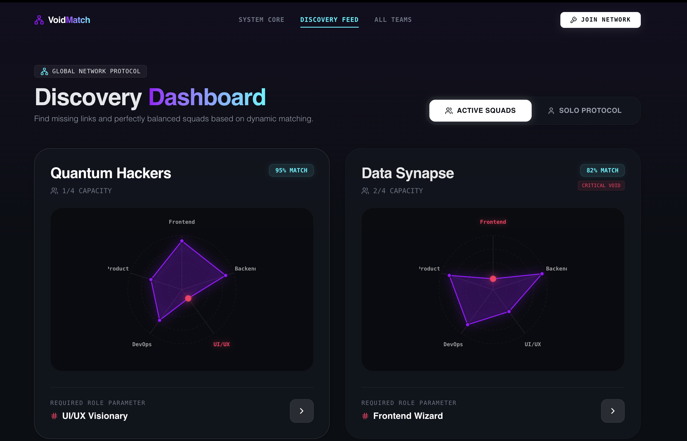
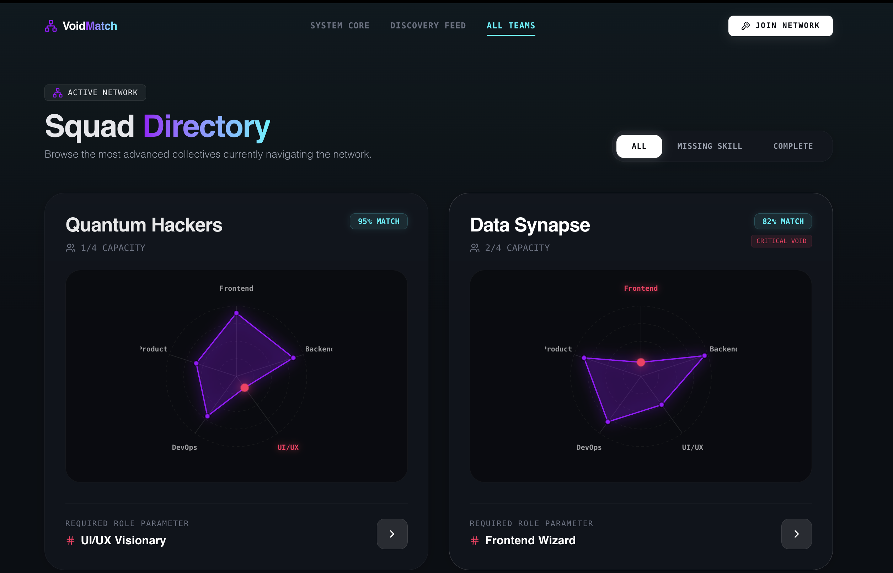

<div align="center">

# ✦ VoidMatch

**Find your place by filling the void.**

Showcase your skills, explore existing teams, and identify missing roles instantly through intelligent data visualization.

[](https://react.dev)
[](https://www.typescriptlang.org)
[](https://vitejs.dev)
[](https://tailwindcss.com)

</div>

---

## Overview

**VoidMatch** is a dark-themed team formation platform that uses interactive radar chart visualizations to help developers find and fill skill gaps in tech squads. Users can browse active squads, see which roles are missing, and instantly join teams as a solo protocol or as part of a group.

---

## Screenshots

### 🏠 System Core — Landing Page

> The entry point. Simple, bold hero with a single CTA to initialize your persona.


---

### 🔭 Discovery Feed — Active Squads

> Browse squads that need your specific skill. Each card shows match %, capacity, and the critical void role.



---

### 🗂 All Teams — Squad Directory

> Full directory of all registered squads across the network, filterable by status: All, Missing Skill, or Complete.



---

## Features

- **Skill Radar Charts** — D3-powered pentagonal radar charts visualize each team's current skill coverage at a glance
- **Smart Match Scoring** — Every squad displays a dynamic match percentage based on your profile vs. team voids
- **Critical Void Detection** — Teams with urgent missing roles are flagged with a `CRITICAL VOID` badge
- **Instajoin Flow** — Zero-friction onboarding to fill a team void directly from the discovery feed
- **Solo Protocol Mode** — Toggle between viewing active squads or available solo developers
- **Squad Directory** — Filter all registered teams by `All`, `Missing Skill`, or `Complete` status
- **Persistent State** — Global app context keeps team rosters and user profile in sync across all views
- **Fluid Animations** — Framer Motion powers all page transitions and micro-interactions

---

## Tech Stack

| Layer | Technology |
|---|---|
| Framework | React 19 + TypeScript |
| Build Tool | Vite 8 |
| Styling | Tailwind CSS v4 |
| Routing | React Router v7 |
| Animations | Framer Motion |
| Data Viz | D3.js |
| Icons | Lucide React |
| State | React Context API |

---

## Project Structure

```
src/
├── components/
│   ├── 3D/               # Three.js 3D elements
│   ├── Layout/           # Navbar and shared layout
│   ├── SkillRadar/       # D3 radar chart component
│   └── Visualizations/   # Other chart & visual components
├── contexts/
│   └── AppContext.tsx    # Global state management
├── pages/
│   ├── Onboarding.tsx        # / — System Core landing & persona setup
│   ├── DiscoveryDashboard.tsx # /discover — Smart squad matching feed
│   ├── Teams.tsx              # /teams — Full squad directory
│   └── TeamDashboard.tsx      # /team/:id — Individual team view
├── lib/                  # Utility functions
├── App.tsx
└── main.tsx
```

---

## Getting Started

### Prerequisites

- Node.js 18+
- npm or yarn

### Installation

```bash
# Clone the repository
git clone https://github.com/your-username/voidmatch.git
cd voidmatch

# Install dependencies
npm install

# Start the dev server
npm run dev
```

Open [http://localhost:5173](http://localhost:5173) in your browser.

### Available Scripts

| Command | Description |
|---|---|
| `npm run dev` | Start local dev server |
| `npm run build` | Production build |
| `npm run preview` | Preview production build |
| `npm run lint` | Run ESLint |

---

## Routes

| Path | Page | Description |
|---|---|---|
| `/` | System Core | Landing page & persona initialization |
| `/discover` | Discovery Feed | Skill-matched squad suggestions |
| `/teams` | All Teams | Full squad directory with filters |
| `/team/:id` | Team Dashboard | Individual squad details & roster |

---

<div align="center">

Built with 🟣 by **Afroj Mulani** && **Arbaz Makandar**

</div>
